# Modèle de Données

> Document de référence -- schéma PostgreSQL d'Offrii.
> Dernière mise à jour des migrations : `20260401000008`.

---

## 1. Vue d'ensemble

### Diagramme entité-relation (Mermaid)

```mermaid
erDiagram

    %% ── Auth ──────────────────────────────────────────────
    users ||--o{ connection_logs           : "audit"
    users ||--o{ email_verification_tokens : "vérification"
    users ||--o{ email_change_tokens       : "changement email"
    users ||--o{ refresh_tokens            : "sessions"
    users ||--o{ push_tokens               : "notifications push"

    %% ── Wishlist ──────────────────────────────────────────
    users      ||--o{ items       : "possède"
    categories ||--o{ items       : "classe"
    users      ||--o{ share_links : "crée"
    share_links ||--o{ items      : "claim via lien"

    %% ── Circles ───────────────────────────────────────────
    users   ||--o{ circles             : "crée (owner)"
    circles ||--o{ circle_members      : "contient"
    users   ||--o{ circle_members      : "appartient à"
    circles ||--o{ circle_items        : "partage"
    items   ||--o{ circle_items        : "partagé dans"
    circles ||--o{ circle_events       : "journal"
    circles ||--o{ circle_share_rules  : "règles"
    circles ||--o{ circle_invites      : "invitations"

    %% ── Social ────────────────────────────────────────────
    users ||--o{ friend_requests : "envoie"
    users ||--o{ friendships     : "ami"

    %% ── Entraide (Community) ──────────────────────────────
    users            ||--o{ community_wishes : "demande"
    users            o|--o{ community_wishes : "matched_with"
    community_wishes ||--o{ wish_reports     : "signalement"
    community_wishes ||--o{ wish_messages    : "messagerie"
    community_wishes ||--o{ wish_blocks      : "masquage"

    %% ── Infra ─────────────────────────────────────────────
    users   ||--o{ notifications : "reçoit"
    circles o|--o{ notifications : "contexte"
    items   o|--o{ notifications : "contexte"
    community_wishes o|--o{ notifications : "contexte"
```



### Domaines fonctionnels

| Domaine | Tables | Migration |
|---------|--------|-----------|
| **Auth** | `users`, `connection_logs`, `email_verification_tokens`, `email_change_tokens` | 001 |
| **Catalogue** | `categories` | 002 |
| **Wishlist** | `items` | 003 |
| **Circles** | `circles`, `circle_members`, `circle_items`, `circle_events`, `circle_share_rules`, `circle_invites` | 004 |
| **Social** | `friend_requests`, `friendships` | 005 |
| **Entraide** | `community_wishes`, `wish_reports`, `wish_messages`, `wish_blocks` | 006 |
| **Infra** | `push_tokens`, `refresh_tokens`, `notifications`, `share_links` | 007 |

---

## 2. Tables par domaine

### 2.1 Auth (migration 001)

#### `users`

Identité principale. Supporte l'authentification email/mot de passe et OAuth (Google, Apple).

| Colonne | Type | Contraintes | Raison |
|---------|------|-------------|--------|
| `id` | `UUID` | PK, `gen_random_uuid()` | Identifiant distribué, pas de collision |
| `email` | `VARCHAR(255)` | `UNIQUE NOT NULL` | Login principal, unicité obligatoire |
| `username` | `VARCHAR(30)` | `UNIQUE`, `CHECK (~ '^[a-z][a-z0-9_]{2,29}$')` | Format normalisé pour URLs et mentions |
| `password_hash` | `VARCHAR(255)` | nullable | `NULL` pour les comptes OAuth-only (pas de mot de passe) |
| `display_name` | `VARCHAR(100)` | nullable | Nom affiché dans l'UI |
| `oauth_provider` | `VARCHAR(20)` | nullable | `google`, `apple` -- identifie le fournisseur |
| `oauth_provider_id` | `VARCHAR(255)` | nullable | ID externe chez le fournisseur OAuth |
| `email_verified` | `BOOLEAN` | `DEFAULT false` | Requis avant d'activer certaines fonctionnalités |
| `token_version` | `INT` | `DEFAULT 1` | Incrémenté au changement de mot de passe -- invalide tous les JWT |
| `is_admin` | `BOOLEAN` | `DEFAULT false` | Contrôle d'accès admin (modération, catégories) |
| `username_customized` | `BOOLEAN` | `DEFAULT false` | Distingue username auto-généré vs choisi par l'utilisateur |
| `avatar_url` | `VARCHAR(2048)` | nullable | URL de la photo de profil |
| `terms_accepted_at` | `TIMESTAMPTZ` | nullable | Obligation légale -- date d'acceptation des CGU |
| `last_active_at` | `TIMESTAMPTZ` | nullable | Suivi d'activité pour les relances |
| `inactivity_notice_sent_at` | `TIMESTAMPTZ` | nullable | Évite d'envoyer plusieurs relances au même utilisateur |
| `created_at` | `TIMESTAMPTZ` | `DEFAULT NOW()` | Horodatage de création |
| `updated_at` | `TIMESTAMPTZ` | `DEFAULT NOW()`, trigger | Mis à jour automatiquement via trigger |

**Index notable** : `idx_users_oauth` -- index partiel unique sur `(oauth_provider, oauth_provider_id) WHERE oauth_provider IS NOT NULL`. Permet une recherche OAuth rapide sans indexer les comptes email-only.

#### `connection_logs`

Journal des connexions -- obligation légale de rétention 12 mois.

| Colonne | Type | Contraintes | Raison |
|---------|------|-------------|--------|
| `id` | `UUID` | PK | -- |
| `user_id` | `UUID` | FK `users` `ON DELETE CASCADE` | Suppression en cascade avec le compte |
| `ip` | `VARCHAR(45)` | `NOT NULL` | Couvre IPv4 et IPv6 |
| `user_agent` | `VARCHAR(512)` | `DEFAULT ''` | Identification du navigateur/appareil |
| `created_at` | `TIMESTAMPTZ` | `DEFAULT NOW()` | Date de connexion |

#### `email_verification_tokens`

Tokens à usage unique pour la vérification d'email. Expiration : **24 heures**.

| Colonne | Type | Contraintes | Raison |
|---------|------|-------------|--------|
| `id` | `UUID` | PK | -- |
| `user_id` | `UUID` | FK `users` `ON DELETE CASCADE` | Nettoyage auto à la suppression du compte |
| `token` | `VARCHAR(64)` | `UNIQUE NOT NULL` | Lookup rapide par token |
| `expires_at` | `TIMESTAMPTZ` | `DEFAULT NOW() + 24h` | Sécurité : limite la fenêtre de validité |
| `created_at` | `TIMESTAMPTZ` | `DEFAULT NOW()` | -- |

#### `email_change_tokens`

Tokens pour le changement d'email. Expiration : **1 heure** (plus court que la vérification, car opération sensible).

| Colonne | Type | Contraintes | Raison |
|---------|------|-------------|--------|
| `id` | `UUID` | PK | -- |
| `user_id` | `UUID` | FK `users` `ON DELETE CASCADE` | -- |
| `new_email` | `VARCHAR(255)` | `NOT NULL` | Adresse cible du changement |
| `token` | `VARCHAR(64)` | `UNIQUE NOT NULL` | -- |
| `expires_at` | `TIMESTAMPTZ` | `DEFAULT NOW() + 1h` | Fenêtre courte pour sécurité |
| `created_at` | `TIMESTAMPTZ` | `DEFAULT NOW()` | -- |

---

### 2.2 Catalogue (migration 002)

#### `categories`

Catégories globales (gérées par les admins, pas par les utilisateurs).

| Colonne | Type | Contraintes | Raison |
|---------|------|-------------|--------|
| `id` | `UUID` | PK | -- |
| `name` | `VARCHAR(100)` | `UNIQUE NOT NULL` | Pas de doublons de noms |
| `icon` | `VARCHAR(50)` | nullable | Nom d'icône pour l'UI |
| `is_default` | `BOOLEAN` | `DEFAULT FALSE` | Pré-sélectionnée pour les nouveaux items |
| `position` | `INTEGER` | `DEFAULT 0` | Ordre d'affichage (0 = premier) |
| `created_at` | `TIMESTAMPTZ` | `DEFAULT NOW()` | -- |

**Données initiales** (seed 008) : Tech, Mode, Maison, Loisirs, Santé, Autre.

---

### 2.3 Wishlist (migration 003)

#### `items`

Élément de liste de souhaits. Peut être partagé dans des circles et réclamé par d'autres utilisateurs.

| Colonne | Type | Contraintes | Raison |
|---------|------|-------------|--------|
| `id` | `UUID` | PK | -- |
| `user_id` | `UUID` | FK `users` `ON DELETE CASCADE` | Propriétaire de l'item |
| `name` | `VARCHAR(255)` | `NOT NULL` | Nom de l'objet souhaité |
| `description` | `TEXT` | nullable | Description libre |
| `estimated_price` | `DECIMAL(10,2)` | nullable | Prix estimatif |
| `priority` | `SMALLINT` | `CHECK (1-3)`, `DEFAULT 2` | 1=haute, 2=moyenne, 3=basse |
| `category_id` | `UUID` | FK `categories` `ON DELETE SET NULL` | `SET NULL` si la catégorie est supprimée |
| `status` | `VARCHAR(20)` | `CHECK ('active','purchased','deleted')`, `DEFAULT 'active'` | Soft delete via `'deleted'` |
| `purchased_at` | `TIMESTAMPTZ` | auto via trigger | Rempli automatiquement au passage en `'purchased'` |
| `claimed_by` | `UUID` | FK `users` `ON DELETE SET NULL` | Qui a réservé l'item |
| `claimed_at` | `TIMESTAMPTZ` | nullable | Quand le claim a eu lieu |
| `claimed_via` | `VARCHAR(20)` | `CHECK ('app','web')` | Origine du claim |
| `claimed_name` | `VARCHAR(100)` | nullable | Nom du claimer -- persiste après suppression du compte |
| `claimed_via_link_id` | `UUID` | FK `share_links` `ON DELETE SET NULL` | Lien de partage utilisé pour le claim |
| `web_claim_token` | `UUID` | nullable | Secret pour gérer un claim anonyme sans compte |
| `image_url` | `TEXT` | nullable | Image uploadée par l'utilisateur |
| `links` | `TEXT[]` | nullable | **Array PostgreSQL** -- URLs associées à l'item |
| `og_image_url` | `TEXT` | nullable | Image OpenGraph auto-fetchée |
| `og_title` | `VARCHAR(500)` | nullable | Titre OpenGraph |
| `og_site_name` | `VARCHAR(200)` | nullable | Nom du site OpenGraph |
| `is_private` | `BOOLEAN` | `DEFAULT FALSE` | `true` = masqué de tous les circles |

**Index clés** :
- `idx_items_user_status` -- requête principale : "mes items actifs"
- `idx_items_claimed_by WHERE claimed_by IS NOT NULL` -- index partiel, évite d'indexer les items non réclamés
- `idx_items_web_claim_token WHERE web_claim_token IS NOT NULL` -- même logique

---

### 2.4 Circles (migration 004)

#### `circles`

Groupes de partage de wishlists. Un circle "direct" (`is_direct=true`) est un duo 1-à-1.

| Colonne | Type | Contraintes | Raison |
|---------|------|-------------|--------|
| `id` | `UUID` | PK | -- |
| `name` | `VARCHAR(100)` | nullable | `NULL` pour les circles directs (l'UI affiche le nom de l'autre membre) |
| `owner_id` | `UUID` | FK `users` `ON DELETE CASCADE` | Créateur du circle |
| `is_direct` | `BOOLEAN` | `DEFAULT false` | `true` = duo, trigger limité à 2 membres max |
| `image_url` | `TEXT` | nullable | Photo de groupe |
| `created_at` | `TIMESTAMPTZ` | `DEFAULT NOW()` | -- |

#### `circle_members`

Table de jonction circles-utilisateurs. PK composite = pas de doublons.

| Colonne | Type | Contraintes | Raison |
|---------|------|-------------|--------|
| `circle_id` | `UUID` | PK, FK `circles` `ON DELETE CASCADE` | -- |
| `user_id` | `UUID` | PK, FK `users` `ON DELETE CASCADE` | -- |
| `role` | `VARCHAR(20)` | `CHECK ('owner','member')`, `DEFAULT 'member'` | Contrôle des permissions |
| `joined_at` | `TIMESTAMPTZ` | `DEFAULT NOW()` | -- |

**Triggers** :
- `trg_circles_add_owner_member` : ajoute automatiquement le créateur comme membre `role='owner'`
- `trg_check_direct_circle_member_limit` : empêche l'ajout d'un 3e membre dans un circle direct

#### `circle_items`

Items partagés dans un circle. PK composite `(circle_id, item_id)` = un item ne peut apparaître qu'une fois par circle.

| Colonne | Type | Contraintes | Raison |
|---------|------|-------------|--------|
| `circle_id` | `UUID` | PK, FK `circles` `ON DELETE CASCADE` | -- |
| `item_id` | `UUID` | PK, FK `items` `ON DELETE CASCADE` | -- |
| `shared_by` | `UUID` | FK `users` `ON DELETE CASCADE` | Peut différer du propriétaire (via share rules) |
| `shared_at` | `TIMESTAMPTZ` | `DEFAULT NOW()` | -- |

#### `circle_events`

Journal d'activité immutable des circles (audit trail).

| Colonne | Type | Contraintes | Raison |
|---------|------|-------------|--------|
| `id` | `UUID` | PK | -- |
| `circle_id` | `UUID` | FK `circles` `ON DELETE CASCADE` | -- |
| `actor_id` | `UUID` | FK `users` `ON DELETE CASCADE` | Qui a effectué l'action |
| `event_type` | `VARCHAR(30)` | `CHECK (9 valeurs)` | Énumération stricte des actions possibles |
| `target_item_id` | `UUID` | FK `items` `ON DELETE SET NULL` | Item concerné (si applicable) |
| `target_user_id` | `UUID` | FK `users` `ON DELETE SET NULL` | Utilisateur concerné (si applicable) |
| `created_at` | `TIMESTAMPTZ` | `DEFAULT NOW()` | -- |

**Types d'événements** : `item_shared`, `item_unshared`, `item_claimed`, `item_unclaimed`, `member_joined`, `member_left`, `item_received`, `share_rule_set`, `share_rule_removed`.

#### `circle_share_rules`

Règles de partage automatique par utilisateur et par circle (circles directs).

| Colonne | Type | Contraintes | Raison |
|---------|------|-------------|--------|
| `circle_id` | `UUID` | PK, FK `circles` `ON DELETE CASCADE` | -- |
| `user_id` | `UUID` | PK, FK `users` `ON DELETE CASCADE` | -- |
| `share_mode` | `VARCHAR(20)` | `CHECK ('none','all','categories','selection')`, `DEFAULT 'none'` | Opt-in explicite (`none` par défaut) |
| `category_ids` | `UUID[]` | `DEFAULT '{}'` | **Array PostgreSQL** -- catégories à partager si `mode='categories'` |
| `created_at` | `TIMESTAMPTZ` | `DEFAULT NOW()` | -- |
| `updated_at` | `TIMESTAMPTZ` | `DEFAULT NOW()` | -- |

#### `circle_invites`

Invitations tokenisées avec limites d'utilisation et expiration.

| Colonne | Type | Contraintes | Raison |
|---------|------|-------------|--------|
| `id` | `UUID` | PK | -- |
| `circle_id` | `UUID` | FK `circles` `ON DELETE CASCADE` | -- |
| `token` | `VARCHAR(32)` | `UNIQUE NOT NULL` | Lookup rapide pour les liens d'invitation |
| `created_by` | `UUID` | FK `users` `ON DELETE CASCADE` | -- |
| `expires_at` | `TIMESTAMPTZ` | `NOT NULL` | Toujours une date d'expiration (pas de lien permanent) |
| `max_uses` | `INTEGER` | `DEFAULT 1` | 1 = usage unique |
| `use_count` | `INTEGER` | `DEFAULT 0` | Incrémenté à chaque utilisation |
| `created_at` | `TIMESTAMPTZ` | `DEFAULT NOW()` | -- |

---

### 2.5 Social (migration 005)

#### `friend_requests`

Demandes d'amitié directionnelles (de A vers B).

| Colonne | Type | Contraintes | Raison |
|---------|------|-------------|--------|
| `id` | `UUID` | PK | -- |
| `from_user_id` | `UUID` | FK `users` `ON DELETE CASCADE` | Expéditeur |
| `to_user_id` | `UUID` | FK `users` `ON DELETE CASCADE` | Destinataire |
| `status` | `VARCHAR(20)` | `CHECK ('pending','accepted','declined','cancelled')`, `DEFAULT 'pending'` | Machine à états de la demande |
| `created_at` | `TIMESTAMPTZ` | `DEFAULT NOW()` | -- |

**Contrainte** : `UNIQUE (from_user_id, to_user_id)` -- une seule demande active par paire directionnelle.

**Index partiels** : `WHERE status = 'pending'` sur `to_user_id` et `from_user_id` -- seules les demandes en attente sont recherchées fréquemment.

#### `friendships`

Amitiés confirmées. Relation bidirectionnelle stockée en une seule ligne.

| Colonne | Type | Contraintes | Raison |
|---------|------|-------------|--------|
| `user_a_id` | `UUID` | PK, FK `users` `ON DELETE CASCADE` | -- |
| `user_b_id` | `UUID` | PK, FK `users` `ON DELETE CASCADE` | -- |
| `created_at` | `TIMESTAMPTZ` | `DEFAULT NOW()` | -- |

**Contrainte** : `CHECK (user_a_id < user_b_id)` -- voir section 4 "Relations clés".

---

### 2.6 Entraide (migration 006)

#### `community_wishes`

Demandes d'aide caritative. Inclut modération IA et matching donneur.

| Colonne | Type | Contraintes | Raison |
|---------|------|-------------|--------|
| `id` | `UUID` | PK | -- |
| `owner_id` | `UUID` | FK `users` `ON DELETE CASCADE` | Demandeur |
| `title` | `VARCHAR(255)` | `NOT NULL` | Titre du souhait |
| `description` | `TEXT` | nullable | Description détaillée |
| `category` | `VARCHAR(30)` | `CHECK (7 valeurs)` | Catégorie spécifique au module entraide |
| `status` | `VARCHAR(20)` | `CHECK (8 valeurs)`, `DEFAULT 'pending'` | Machine à états complexe (voir ci-dessous) |
| `is_anonymous` | `BOOLEAN` | `DEFAULT FALSE` | Masque l'identité pour les catégories sensibles |
| `matched_with` | `UUID` | FK `users` `ON DELETE SET NULL` | Donneur -- `SET NULL` si le donneur supprime son compte |
| `matched_at` | `TIMESTAMPTZ` | nullable | Date du matching |
| `fulfilled_at` | `TIMESTAMPTZ` | nullable | Date de réalisation |
| `closed_at` | `TIMESTAMPTZ` | nullable | Date de fermeture |
| `report_count` | `INT` | `DEFAULT 0` | Au seuil de 5, passage auto en `'review'` |
| `reopen_count` | `INT` | `DEFAULT 0` | Max 2 réouvertures, cooldown 24h |
| `last_reopen_at` | `TIMESTAMPTZ` | nullable | Pour le cooldown de réouverture |
| `moderation_note` | `TEXT` | nullable | Explication admin/IA du flag ou rejet |
| `image_url` | `TEXT` | nullable | -- |
| `links` | `TEXT[]` | nullable | **Array PostgreSQL** |
| `og_image_url` | `TEXT` | nullable | -- |
| `og_title` | `VARCHAR(500)` | nullable | -- |
| `og_site_name` | `VARCHAR(200)` | nullable | -- |
| `created_at` | `TIMESTAMPTZ` | `DEFAULT NOW()` | -- |
| `updated_at` | `TIMESTAMPTZ` | `DEFAULT NOW()`, trigger | -- |

**Machine à états du status** :

```
pending --> open        (modération IA OK)
pending --> flagged     (modération IA doute)
pending --> rejected    (modération IA ou admin refuse)
flagged --> open        (admin approuve)
flagged --> rejected    (admin confirme le flag)
open    --> matched     (donneur se manifeste)
matched --> fulfilled   (aide livrée)
matched --> open        (donneur se désiste, réouverture)
open    --> closed      (demandeur ferme)
*       --> review      (report_count >= 5)
```

#### `wish_reports`

Signalements communautaires -- un report par utilisateur par souhait.

| Colonne | Type | Contraintes | Raison |
|---------|------|-------------|--------|
| `id` | `UUID` | PK | -- |
| `wish_id` | `UUID` | FK `community_wishes` `ON DELETE CASCADE` | -- |
| `reporter_id` | `UUID` | FK `users` `ON DELETE CASCADE` | -- |
| `reason` | `VARCHAR(50)` | `CHECK ('inappropriate','spam','scam','other')`, `DEFAULT 'inappropriate'` | Catégorisation du signalement |
| `details` | `TEXT` | nullable | Détails supplémentaires |
| `created_at` | `TIMESTAMPTZ` | `DEFAULT NOW()` | -- |

**Contrainte** : `UNIQUE (wish_id, reporter_id)` -- empêche les signalements multiples.

#### `wish_messages`

Messagerie privée entre demandeur et donneur. Messages anonymisés à la suppression de l'expéditeur.

| Colonne | Type | Contraintes | Raison |
|---------|------|-------------|--------|
| `id` | `UUID` | PK | -- |
| `wish_id` | `UUID` | FK `community_wishes` `ON DELETE CASCADE` | -- |
| `sender_id` | `UUID` | FK `users` `ON DELETE SET NULL` | `SET NULL` = message conservé mais expéditeur anonymisé |
| `body` | `TEXT` | `NOT NULL` | -- |
| `created_at` | `TIMESTAMPTZ` | `DEFAULT NOW()` | -- |

#### `wish_blocks`

Masquage par utilisateur -- le souhait bloqué disparaît de ses listes.

| Colonne | Type | Contraintes | Raison |
|---------|------|-------------|--------|
| `id` | `UUID` | PK | -- |
| `wish_id` | `UUID` | FK `community_wishes` `ON DELETE CASCADE` | -- |
| `user_id` | `UUID` | FK `users` `ON DELETE CASCADE` | -- |
| `created_at` | `TIMESTAMPTZ` | `DEFAULT NOW()` | -- |

**Contrainte** : `UNIQUE (wish_id, user_id)` -- un seul bloc par utilisateur par souhait.

---

### 2.7 Infra (migration 007)

#### `push_tokens`

Tokens APNs/FCM pour les notifications push. Un utilisateur peut avoir plusieurs appareils.

| Colonne | Type | Contraintes | Raison |
|---------|------|-------------|--------|
| `id` | `UUID` | PK | -- |
| `user_id` | `UUID` | FK `users` `ON DELETE CASCADE` | -- |
| `token` | `VARCHAR(500)` | `NOT NULL` | Token du device |
| `platform` | `VARCHAR(10)` | `CHECK ('ios','android')` | Routage vers le bon service de push |
| `created_at` | `TIMESTAMPTZ` | `DEFAULT NOW()` | -- |

**Contrainte** : `UNIQUE(user_id, token)` -- pas de doublon device pour le même utilisateur.

#### `refresh_tokens`

Tokens JWT long-lived pour la gestion de sessions.

| Colonne | Type | Contraintes | Raison |
|---------|------|-------------|--------|
| `id` | `UUID` | PK | -- |
| `user_id` | `UUID` | FK `users` `ON DELETE CASCADE` | -- |
| `token_hash` | `VARCHAR(255)` | `UNIQUE NOT NULL` | Hash SHA256 -- le token brut n'est jamais stocké |
| `expires_at` | `TIMESTAMPTZ` | `NOT NULL` | -- |
| `revoked_at` | `TIMESTAMPTZ` | nullable | `NOT NULL` = token révoqué (logout ou changement mdp) |
| `created_at` | `TIMESTAMPTZ` | `DEFAULT NOW()` | -- |

**Index partiel** : `idx_refresh_tokens_active_expires WHERE revoked_at IS NULL` -- seuls les tokens actifs sont recherchés.

#### `notifications`

Flux de notifications in-app avec contexte polymorphe. 20 types. Nettoyage après 6 mois.

| Colonne | Type | Contraintes | Raison |
|---------|------|-------------|--------|
| `id` | `UUID` | PK | -- |
| `user_id` | `UUID` | FK `users` `ON DELETE CASCADE` | Destinataire |
| `type` | `VARCHAR(50)` | `CHECK (20 valeurs)` | Type strict -- voir liste ci-dessous |
| `title` | `TEXT` | `NOT NULL` | Titre affiché |
| `body` | `TEXT` | `NOT NULL` | Corps du message |
| `read` | `BOOLEAN` | `DEFAULT FALSE` | État lu/non-lu pour le badge |
| `circle_id` | `UUID` | FK `circles` `ON DELETE SET NULL` | Contexte optionnel |
| `item_id` | `UUID` | FK `items` `ON DELETE SET NULL` | Contexte optionnel |
| `wish_id` | `UUID` | FK `community_wishes` `ON DELETE SET NULL` | Contexte optionnel |
| `actor_id` | `UUID` | FK `users` `ON DELETE SET NULL` | "X a fait Y" dans le feed |
| `created_at` | `TIMESTAMPTZ` | `DEFAULT NOW()` | -- |

**Types de notification** :

| Domaine | Types |
|---------|-------|
| Amis | `friend_request`, `friend_accepted` |
| Circles | `circle_activity`, `circle_added`, `circle_member_joined` |
| Items | `item_shared`, `item_claimed`, `item_unclaimed`, `item_received` |
| Modération | `wish_moderation_approved`, `wish_moderation_flagged` |
| Entraide | `wish_offer`, `wish_offer_withdrawn`, `wish_offer_rejected`, `wish_closed`, `wish_approved`, `wish_rejected`, `wish_confirmed`, `wish_message`, `wish_reported` |

#### `share_links`

URLs publiques de partage de wishlists. Permettent la consultation et le claim sans authentification.

| Colonne | Type | Contraintes | Raison |
|---------|------|-------------|--------|
| `id` | `UUID` | PK | -- |
| `user_id` | `UUID` | FK `users` `ON DELETE CASCADE` | Propriétaire du lien |
| `token` | `VARCHAR(32)` | `UNIQUE NOT NULL` | Identifiant dans l'URL |
| `label` | `VARCHAR(100)` | nullable | Nom du lien pour l'utilisateur |
| `permissions` | `VARCHAR(20)` | `CHECK ('view_only','view_and_claim')`, `DEFAULT 'view_and_claim'` | Niveau d'accès |
| `scope` | `VARCHAR(20)` | `CHECK ('all','category','selection')`, `DEFAULT 'all'` | Périmètre du partage |
| `scope_data` | `JSONB` | nullable | IDs de catégories ou d'items selon le scope |
| `is_active` | `BOOLEAN` | `DEFAULT TRUE` | Désactivation sans suppression |
| `created_at` | `TIMESTAMPTZ` | `DEFAULT NOW()` | -- |
| `expires_at` | `TIMESTAMPTZ` | nullable | `NULL` = lien permanent |

---

## 3. Patterns de conception

### 3.1 Clés primaires UUID

Toutes les tables utilisent `UUID PRIMARY KEY DEFAULT gen_random_uuid()`.

| Avantage | Détail |
|----------|--------|
| Pas de collision | Génération distribuée possible (pas de séquence centralisée) |
| Sécurité | Imprévisible -- pas d'énumération séquentielle des ressources |
| Portabilité | Les IDs survivent aux migrations et merges de bases |

### 3.2 Soft delete (items)

Les items ne sont jamais physiquement supprimés. Le champ `status` passe à `'deleted'`.

```
active --> deleted    (suppression logique)
active --> purchased  (quelqu'un a acheté)
deleted --> active    (restauration possible)
```

**Pourquoi** : préserve l'historique de partage dans les circles, et les relations `claimed_by` restent cohérentes.

### 3.3 Audit trail (`created_at` / `updated_at`)

| Pattern | Implémentation |
|---------|---------------|
| `created_at` | `TIMESTAMPTZ NOT NULL DEFAULT NOW()` -- immutable |
| `updated_at` | `TIMESTAMPTZ NOT NULL DEFAULT NOW()` + trigger `set_updated_at()` |

La fonction `set_updated_at()` est définie une seule fois (migration 001) et réutilisée par toutes les tables qui en ont besoin (`users`, `items`, `circle_share_rules`, `community_wishes`).

### 3.4 Suppressions en cascade

| Stratégie | Utilisation | Raison |
|-----------|-------------|--------|
| `ON DELETE CASCADE` | `connection_logs`, `circle_members`, `circle_items`, etc. | Données dépendantes sans valeur propre après suppression du parent |
| `ON DELETE SET NULL` | `items.category_id`, `items.claimed_by`, `wish_messages.sender_id`, `notifications.*_id` | L'entité enfant a une valeur propre même sans le parent |

**Cas spécial** : trigger `cleanup_matched_wishes_on_user_delete()` -- à la suppression d'un utilisateur donneur, les souhaits qu'il avait matché repassent en `'open'` (pas de `SET NULL` brut qui laisserait un wish en état `'matched'` sans donneur).

### 3.5 CHECK constraints pour les énumérations

Plutôt que des tables de référence ou des types ENUM PostgreSQL, le schéma utilise des `CHECK IN (...)`.

| Avantage | Détail |
|----------|--------|
| Simplicité | Pas de migration pour ajouter un type ENUM |
| Lisibilité | Les valeurs autorisées sont visibles directement dans le DDL |
| Flexibilité | Modification par `ALTER TABLE ... DROP/ADD CONSTRAINT` sans recréation de type |

**Tables concernées** : `items.status`, `items.priority`, `circle_members.role`, `circle_share_rules.share_mode`, `circle_events.event_type`, `friend_requests.status`, `community_wishes.category`, `community_wishes.status`, `wish_reports.reason`, `push_tokens.platform`, `notifications.type`, `share_links.permissions`, `share_links.scope`.

### 3.6 Arrays PostgreSQL (`TEXT[]`, `UUID[]`)

| Table | Colonne | Type | Contenu |
|-------|---------|------|---------|
| `items` | `links` | `TEXT[]` | URLs associées à l'item |
| `community_wishes` | `links` | `TEXT[]` | URLs associées au souhait |
| `circle_share_rules` | `category_ids` | `UUID[]` | Catégories à partager automatiquement |

**Pourquoi des arrays plutôt que des tables de jonction** : ces listes sont courtes (< 10 éléments), toujours lues/écrites en bloc, et ne nécessitent pas de jointures ou de requêtes sur les éléments individuels.

### 3.7 Triggers

| Trigger | Table | Fonction |
|---------|-------|----------|
| `trg_users_updated_at` | `users` | Auto-mise à jour de `updated_at` |
| `trg_items_updated_at` | `items` | Auto-mise à jour de `updated_at` |
| `trg_items_set_purchased_at` | `items` | Auto-remplissage/vidage de `purchased_at` selon le `status` |
| `trg_circles_add_owner_member` | `circles` | Auto-ajout du créateur comme `circle_member` avec `role='owner'` |
| `trg_check_direct_circle_member_limit` | `circle_members` | Bloque l'insertion si un circle direct a déjà 2 membres |
| `set_community_wishes_updated_at` | `community_wishes` | Auto-mise à jour de `updated_at` |
| `trg_cleanup_matched_wishes` | `users` | Remet les souhaits matchés en `'open'` avant suppression du donneur |

---

## 4. Relations clés

### 4.1 `users` --> `items` (1:N)

Relation principale de l'application. Chaque utilisateur possède zéro ou plusieurs items.

- **FK** : `items.user_id REFERENCES users(id) ON DELETE CASCADE`
- **Index** : `idx_items_user_status` -- requête principale par utilisateur et statut
- Un item supprimé (`status='deleted'`) reste en base mais n'apparaît plus dans les listes

### 4.2 `circles` <--> `circle_members` (N:N via jonction)

Relation many-to-many entre utilisateurs et circles.

- **PK composite** : `(circle_id, user_id)` -- empêche les doublons
- **Trigger auto-ajout** : à la création d'un circle, le créateur est ajouté avec `role='owner'`
- **Trigger limite** : les circles directs (`is_direct=true`) sont limités à 2 membres
- Les deux FK sont `ON DELETE CASCADE` : si un circle ou un utilisateur est supprimé, le membership disparaît

### 4.3 `circles` --> `circle_items` (items partagés)

Matérialise quels items sont visibles dans quels circles.

- **PK composite** : `(circle_id, item_id)` -- un item n'apparaît qu'une fois par circle
- `shared_by` != `user_id` de l'item est possible (partage via share rules)
- `ON DELETE CASCADE` des deux côtés : suppression du circle ou de l'item nettoie la relation

### 4.4 `circle_share_rules` (partage dynamique par mode)

Contrôle le partage automatique des items d'un utilisateur vers un circle.

| Mode | Comportement |
|------|-------------|
| `none` | Aucun partage automatique (défaut -- opt-in explicite) |
| `all` | Tous les items non-privés sont partagés |
| `categories` | Seuls les items des catégories listées dans `category_ids[]` sont partagés |
| `selection` | Sélection manuelle -- pas de partage automatique, mais items choisis un par un |

La PK composite `(circle_id, user_id)` garantit une seule règle par utilisateur par circle.

### 4.5 `community_wishes` --> sous-tables

| Relation | Table enfant | Contrainte unicité | Raison |
|----------|-------------|-------------------|--------|
| 1:N | `wish_reports` | `UNIQUE(wish_id, reporter_id)` | Un seul signalement par utilisateur |
| 1:N | `wish_messages` | aucune | Conversation libre entre demandeur et donneur |
| 1:N | `wish_blocks` | `UNIQUE(wish_id, user_id)` | Un seul masquage par utilisateur |

Toutes les sous-tables sont en `ON DELETE CASCADE` depuis `community_wishes` : la suppression d'un souhait nettoie tout le contexte associé.

### 4.6 `friendships` -- ordre canonique (`user_a_id < user_b_id`)

Le `CHECK (user_a_id < user_b_id)` résout un problème classique des relations bidirectionnelles :

| Sans contrainte | Avec contrainte |
|-----------------|-----------------|
| Paire (Alice, Bob) peut exister comme `(alice, bob)` ET `(bob, alice)` | Seule `(alice, bob)` est stockée (car `alice_uuid < bob_uuid`) |
| Requête "sont-ils amis ?" nécessite `OR` | Requête simplifiée avec un seul `WHERE` |
| Risque de doublons | **Impossible par construction** (PK + CHECK) |

**En pratique** : le code applicatif doit trier les deux UUIDs avant l'insertion. La requête de vérification d'amitié :

```sql
SELECT 1 FROM friendships
WHERE user_a_id = LEAST(id1, id2)
  AND user_b_id = GREATEST(id1, id2);
```
